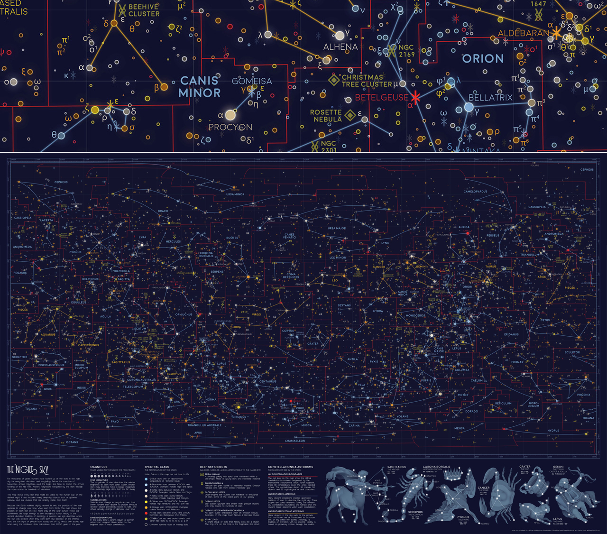
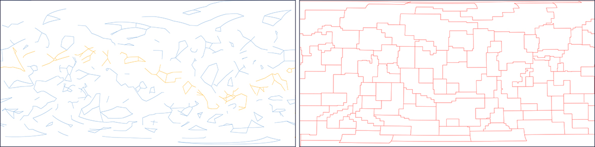
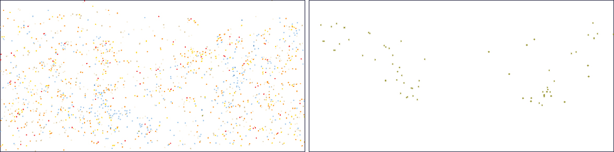
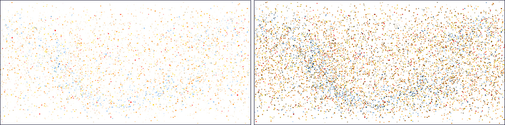
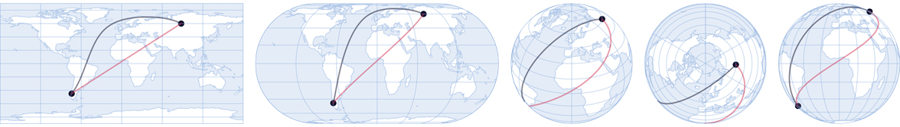
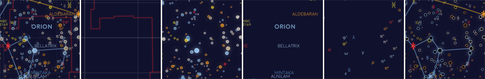
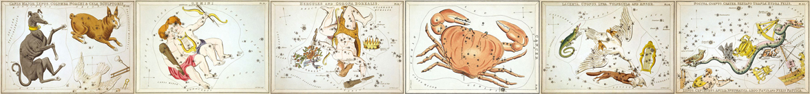
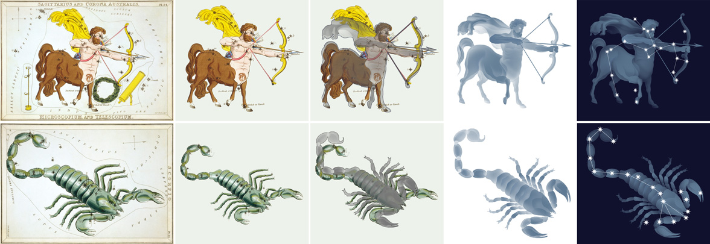

# All the Stars You Can See from Earth

[](https://www.gnu.org/licenses/gpl-3.0)
[](https://twitter.com/eleanor_lutz)
[](https://github.com/eleanorlutz)

This repository explains how to make a map of Western constellations using open-source data from [Stellarium](https://stellarium.org/) and the [HYG Database](http://www.astronexus.com/hyg) (Hipparcos, Yale Bright Star, and Gliese catalogs). Software used includes `Python 3.7.1`, `Illustrator CC 2019` and `Photoshop CC 2019`. If you have comments or suggestions for this tutorial, please let me know [on my blog](http://tabletopwhale.com/2019/07/15/the-western-constellations.html)! You can also buy the [finished map here](https://www.redbubble.com/people/eleanorlutz/works/39435018) if you like.

**Python dependencies:** `matplotlib` `numpy` `cartopy` `pandas` `jupyter`. Dependencies can be installed with `pip install -r requirements.txt`.



## Special instructions for beginners

##### If you're new to coding:

[Software Carpentry](https://software-carpentry.org/) has great tutorials for [installing Python](https://carpentries.github.io/workshop-template/) (scroll down and follow the directions in  the Bash Shell and Python sections), [getting starting with Jupyter Notebooks](http://swcarpentry.github.io/python-novice-inflammation/setup/index.html), and [beginner-friendly Python programming](http://swcarpentry.github.io/python-novice-inflammation/aio/index.html). After you've installed Python using these tutorials, you can use [Git Desktop](https://desktop.github.com/) and the instructions in [this tutorial](https://help.github.com/en/desktop/contributing-to-projects/cloning-a-repository-from-github-desktop) to download the code and data in this tutorial.

##### If you're new to design:

You'll need software for editing raster and vector images ([this article](https://vector-conversions.com/vectorizing/raster_vs_vector.html) explains the difference). I use [Adobe Photoshop](https://www.adobe.com/products/photoshop.html) and [Illustrator](https://www.adobe.com/products/illustrator.html), but you can also use the free open-source programs [Gimp](https://www.gimp.org/downloads/) and [Inkscape](https://inkscape.org/release/inkscape-0.92.4/). There is no perfect software that fits everyone's needs, so you'll want to understand the pros and cons for the different [raster](https://www.colorexpertsbd.com/blog/brief-comparison-photoshop-gimp) and [vector](https://logosbynick.com/inkscape-vs-illustrator-vs-coreldraw/) programs before choosing.

## Table of Contents

1. [Gathering and processing data](#data)
2. [Map design in Python](#python)
3. [Map design in Illustrator and Photoshop](#illustrator_photoshop)
4. [References](#references)
5. [License](#license)

<a name="data"/>

## Gathering and processing data

#### Stars

To map these stars I used David Nash's [HYG Database version 3](http://www.astronexus.com/hyg), which combines all stars from the Hipparcos, Yale Bright Star, and Gliese catalogs. This dataset provides the *right ascension* (RA) and *declination* (DEC) for each star - the celestial equivalent of longitude and latitude - as well as the spectral class, magnitude, name, ID number, and various other measurements. I edited the original dataset in `1_process_starbase_data.ipynb` to only include visible stars (magnitude <= 6.5).

#### Constellations and Asterisms

What we call "constellations" in popular English are actually unofficial shapes called asterisms (shown in blue and yellow, below left). I downloaded the classical Western asterisms through [Stellarium](https://github.com/Stellarium/stellarium), an open-source planetarium software. In the Stellarium Git repository, these asterisms are found in the `skycultures/western/` folder as `constellationship.fab` and `constellation_names.eng.fab`. This data is provided as a list of star ID numbers that should be connected to form each of the lines in the asterisms. To plot the asterisms on a map, I matched each star ID number to the same entry in the HYG Database, and converted ID number into RA and DEC location values for each asterism vertex.



The official IAU constellation boundaries (shown in red, above right) are available from the Royal Observatory Edinburgh [Catalogue of Constellation Boundary Data](http://cdsarc.u-strasbg.fr/viz-bin/Cat?VI/49#sRM2.2) (used with permission). The data is included in this repository in original tarball form `VI_49.tar.gz` as well as the extracted form `VI_49`.

For labeling each constellation, I also made a table of the approximate center position, name, and name meaning of each constellation based on Table L1 of the [OpenStax Astronomy](https://openstax.org/details/astronomy) textbook (`./data/processed/centered_constellations.csv`).

#### Bayer Designations and Messier Objects

The tiny Greek letters next to some of the stars are Bayer designations - a common type of stellar identifier. I used the code in `1_process_starbase_data.ipynb` to change the formatting of each Bayer designation so that the text would be plotted correctly in Python Matplotlib, with the appropriate superscripts and Greek symbols.

This map also includes all of the brightest galaxies, nebulae, and star clusters from W.H. Finlay’s [Concise Catalog of Deep-sky Objects](https://www.springer.com/us/book/9781852338510). I used this book to create a data file with the location, class, and name of all visible (magnitude <= 6.5) Messier objects, Herschell 400 objects, and Royal Astronomical Society of Canada's Finest 110 NGC objects. Deep Sky Object magnitudes are not the same as star magnitudes, so it's possible that some objects in this map are not visible to the naked eye (if the object has a very large area).



#### Map Projections
I used a Plate Carrée projection for this map, because the perpendicular gridlines make it easy to read coordinates (which are essential for finding stars that rise and set throughout the night). However, Plate Carrée tends to distort maps quite a bit, so it's rarely used. The same code in this repository can be used to create maps in any other [supported projection](https://scitools.org.uk/cartopy/docs/latest/crs/projections.html) by changing the axis projection variable `plt.axes(projection=cartopy.crs.PlateCarree())`.


<a name="python"/>

## Map design in Python

To make this map I combined about 10 Python-generated maps (constellations, asterisms, gridlines, stars (colors), stars (outlines), variable stars, bayer designations, messier objects, and text labels for stars, constellations, and messier objects). I often split up data for plotting so I can easily apply section-specific effects in Photoshop or Illustrator, like the glow effect applied in this map. The plotting code for all of these maps are shared in `6_plot_maps.ipynb`.

#### Star colors and sizes
This map plots the size of each star based on its magnitude, or the relative brightness as seen from Earth. Star magnitude doesn’t measure the actual size of the star, so it’s possible for a small star to have a larger magnitude than a massive star if the smaller star is closer to Earth. To select just visible stars I picked only stars with a magnitude <= 6.5 out of the HYG Database.

The star colors are somewhat close to the true colors, but they’re exaggerated to make the difference between similar stars easier to see on the dark background. I used the [OpenStax Astronomy](https://openstax.org/details/astronomy) textbook to map the spectral class IDs from the HYG Database to approximate star colors.



#### Unicode Symbols in Matplotlib
In this map I used different Unicode characters to mark each of the different kinds of non-star bright objects, like nebulae, galaxies, and star clusters ( &#5816; &#10020; &#9672; &#5861; &#9096; &#8527; &#5819; ). I used the [Unicode Character Table](https://unicode-table.com/en/) to pick out my favorite characters, and I followed the tutorial [How to plot unicode characters with Matplotlib](https://jdhao.github.io/2018/04/08/matplotlib-unicode-character/) to plot each Unicode character in Matplotlib.

#### Great-circle distance
The lines connecting each of the stars in this map visualizes the *Great Circle Distance*, which is the shortest path between the two points on a globe. These lines don't always look straight on the map, because the 2D map projection distorts the actual spherical 3D data (to illustrate, all the black lines in the Earth examples below show the great circle distance between the same two points). The red line visualizes how a line that *appears* straight on a Plate Carrée projection (far left) is not actually straight.



#### Saving Matplotlib figures

I usually save figures as a PDF so I can edit the text and shapes in Illustrator. There are a couple standard commands I use to export Matplotlib figures so they're easy to edit:

```python
import matplotlib
import matplotlib.pyplot as plt
import matplotlib.backends.backend_pdf as pdf

# Export text as editable text instead of shapes:
matplotlib.rcParams['pdf.fonttype'] = 42

# Preserve the vertical order of embedded images:
matplotlib.rcParams['image.composite_image'] = False

# Remove borders and ticks from subplots:
ax.axis('off')

# Remove padding and margins from the figure and all its subplots
plt.margins(0,0)
plt.subplots_adjust(top=1, bottom=0, right=1, left=0, hspace=0, wspace=0)
plt.gca().xaxis.set_major_locator(plt.NullLocator())
plt.gca().yaxis.set_major_locator(plt.NullLocator())

# Save the Matplotlib figure as a PDF file:
pp = pdf.PdfPages('./savename.pdf', keep_empty=False)
pp.savefig(fig)
pp.close()

# If I don't need to edit vector paths I save the file as a
# PNG so I can import it directly into Photoshop:
plt.savefig('./savename.png', format='png', dpi=600, pad_inches=0, transparent=True)
```

After saving the figure, the `PDF` file needs to be edited so that each object can be manipulated individually. In Illustrator,  select everything in the file and then go to `Object` --> `Clipping Mask` --> `Release`. At this point you can also delete the background and axis border objects, if you included them in the output file.

<a name="illustrator_photoshop"/>

## Map design in Illustrator and Photoshop

I export Python figures to Illustrator and Photoshop because several great design features are impossible or very time-consuming in Matplotlib. I'm linking tutorials here for the features I use most often - [font alternates](https://helpx.adobe.com/illustrator/using/special-characters.html) and [ligatures](https://helpx.adobe.com/illustrator/using/special-characters.html#use_ligatures_and_contextual_alternates), [custom brushes](https://helpx.adobe.com/illustrator/using/brushes.html), [layering effects](https://helpx.adobe.com/photoshop/using/layer-effects-styles.html), [blur effects](https://helpx.adobe.com/photoshop/using/blur-gallery.html), [gradients along a path](http://blog.gilbertconsulting.com/2017/06/using-gradients-on-strokes-in.html), [variable width paths](https://iamsteve.me/blog/entry/creating-custom-stroke-width-profiles-in-illustrator), [type on a path](https://helpx.adobe.com/illustrator/using/creating-type-path.html), and [selecting objects by characteristic](https://helpx.adobe.com/illustrator/using/selecting-objects.html#select_objects_by_characteristic).


#### Layering in Photoshop

I've included a small section of the map in the `figures` folder as the Photoshop file `stars_sample.psd`. It still has the original layers, so you should be able to use it as a reference for layering and color effects. I also included a second file `decoration_sample.psd`, which includes all the original layers for the illustrations at the bottom of the map.




#### Shadows and Glow Effects

To create a glow effect around each star, duplicate the star color layer and go to `Filter` --> `Blur Gallery` --> `Field Blur`. For glowing text or objects I usually create two blur layers set to 20% opacity - one with a `Blur` of 4px and the other 10px. In this map I added a glow effect to the text labels and all of the star scatterpoints. I also added a dark shadow underneath the text labels to make them easier to read. You can make this shadow effect in almost exactly the same way as the glow effect: Before applying the `Field Blur`, change the color of all text objects in the duplicated layer to the color you'd like to use for the shadow. I think it's easiest to change the colors in the original Illustrator image instead of in Photoshop (especially for text and complex object shapes).

#### Color and Font

I wanted the maps in this series to look cohesive, so I made a palette of ~70 different colors and picked from these choices in every map. I also used the same two fonts ([Redflowers](https://creativemarket.com/TypeandStudio/923689-RedFlower-Typeface) and [Moon](https://harvatt.house/store/moon-font)) in all maps. You're welcome to use the color palette and font styling if you'd like.


#### Updating vintage illustrations in Photoshop

 I used the illustrations from the 1824 star chart [Urania's Mirror](https://en.wikipedia.org/wiki/Urania%27s_Mirror) as reference for illustrating the asterisms.



To update these illustrations from Urania’s Mirror, I first mapped each constellation using the modern HYG star database (`5_plot_orthographic_references.ipynb`). Then I adjusted pieces of the Urania’s Mirror illustrations to fit next to the modern star alignments. I also increased the contrast between shapes and removed some confusing details, like the quiver on the centaur’s back in the example below. The full-size map already shows the actual magnitudes of each star, so I decided to use a more artistic style for these illustrated stars. Each star is drawn as a sunburst with many rays, and the stars are all the same size so the constellation pattern is easier to see against the illustrated background.



<a name="references"/>

## References

- [Astronomy](https://openstax.org/details/astronomy). Andrew Fraknoi, David Morrison, Sidney C. Wolff et al. OpenStax 2016.
- [Concise Catalog of Deep-sky Objects](https://www.springer.com/us/book/9781852338510). W.H. Finlay. Springer 2003.
- [Urania's mirror, or, A view of the heavens](https://www.loc.gov/item/2013645050/). Richard Rouse Bloxam, Sidney Hall, and Jehoshaphat Aspin. Samuel Leigh 1824.
- [Unicode Character Table](https://unicode-table.com/en/). Sergei Asanov and Oleg Grigoriev. 2019.
- [HYG Database version 3](http://www.astronexus.com/hyg). David Nash. 2019.
- [Western Constellation Lines](http://hemel.waarnemen.com/download/#cetera). Marc van der Sluys 2005.
- [Catalogue of Constellation Boundary Data](http://cdsarc.u-strasbg.fr/viz-bin/Cat?VI/49#sRM2.2). A.C. Davenhall and S.K. Leggett. Royal Observatory Edinburgh 1989.
- [Stellarium](https://stellarium.org/) 2019 version 0.19.0.
- **Fonts:** [Moon](https://harvatt.house/store/moon-font) by Jack Harvatt and [RedFlower](https://creativemarket.com/TypeandStudio/923689-RedFlower-Typeface) by Type & Studio.
- **Advice:** Thank you to Oliver Fraser, Marc van der Sluys, Chloe Pursey, and Leah Willey for their helpful advice in making this map.

<a name="license"/>

## License

**Code:** All of the code in this repository is shared under the [GPL-3.0 license](https://www.gnu.org/licenses/gpl-3.0).

**Data:** The data in this repository belongs to the original authors of the data. Please use the references section to look up the original version. In cases where I edited or revised the data, I impose no additional restrictions to the original license. Any data files I created myself are shared under the [ODC Open Database License](https://opendatacommons.org/licenses/odbl/summary/).

**Artwork:** The artwork included in this repository are shared under a [Creative Commons Attribution-NonCommercial-NoDerivatives 4.0 International License](https://creativecommons.org/licenses/by-nc-nd/4.0/).
